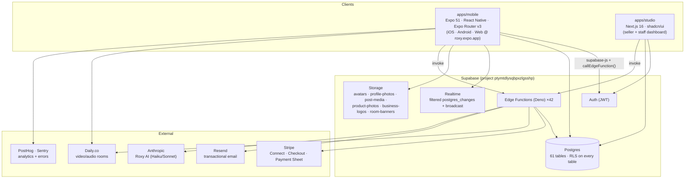
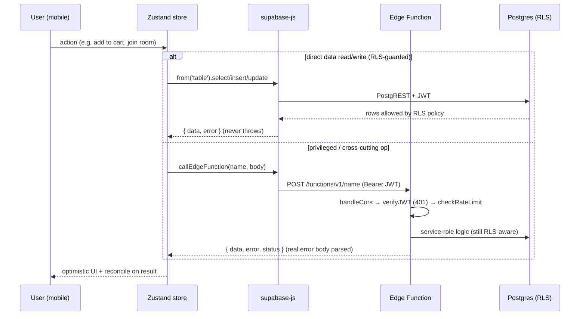
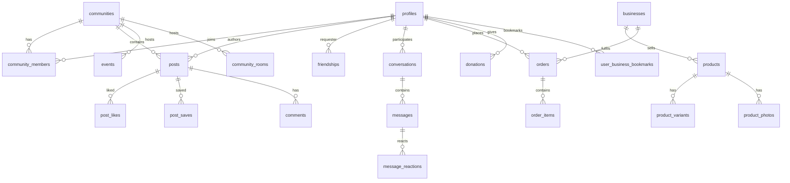
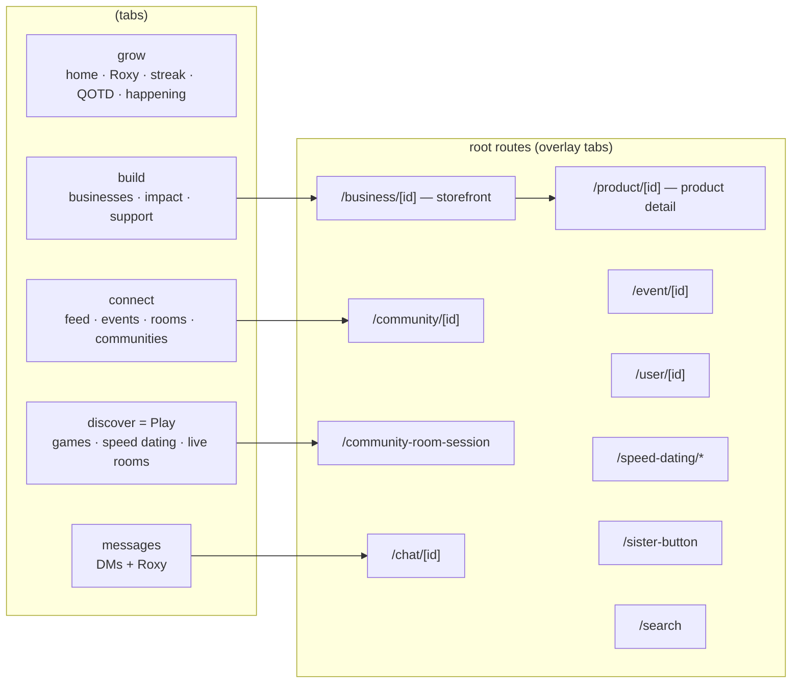
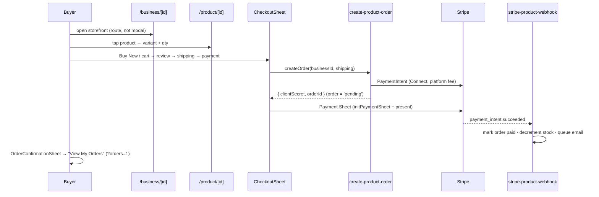
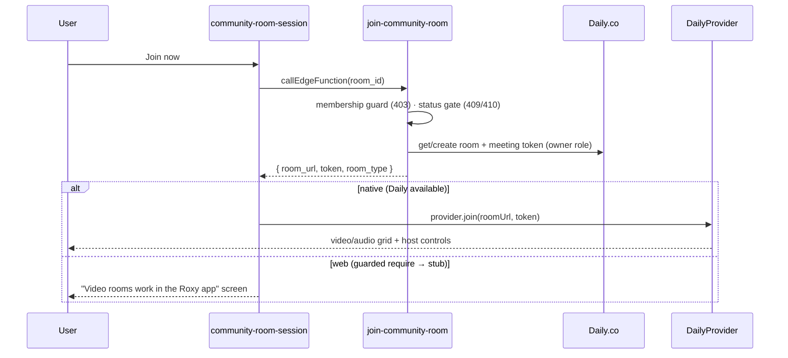
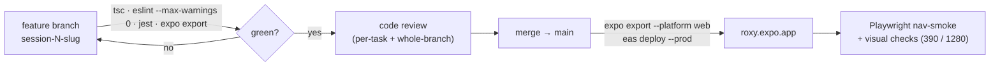

# Roxy — Architecture

Roxy is a community-first WLW social + dating platform. This document describes
how the system is put together: the apps, the backend, the request lifecycle,
the data model, navigation, the load-bearing domain flows, and the security
model. Diagrams are [Mermaid](https://mermaid.js.org/) and render on GitHub.

> Scope: `apps/mobile` (the end-user client) is the focus; `apps/studio` (the
> seller/staff dashboard) and the shared Supabase backend are included where
> they interact with the client. Finer-grained history lives in `CHANGELOG.md`
> and `.claude/log.md`.

---

## 1. System context



**Cloud stage:** Stage 1 (edge) — Supabase + EAS Hosting (Vercel/Cloudflare
edge for web). Native-only capabilities (Daily.co video) degrade gracefully to
a "works in the app" screen on web via a guarded `require`.

---

## 2. Request lifecycle

Every privileged action goes through an edge function; direct table access from
the client is always mediated by Row-Level Security.



Key conventions:
- **`supabase-js` returns errors, it never throws** — every call checks
  `error`. Optimistic updates roll back on `error`.
- **`callEdgeFunction`** (`lib/supabase.ts`) returns `{ data, error, status }`
  and parses `FunctionsHttpError.context.json()` for the real server error body.
- **Web-safe dialogs:** `react-native-web` stubs `Alert.alert`, so all confirms
  route through `lib/confirm.ts` (`confirmAction`/`showAlert`).

---

## 3. Data model (core)

61 tables total; the core social + commerce entities and their relationships:



- **Tenancy** is community-scoped: `profiles → community_members → communities`.
  Every content table (`posts`, `events`, `community_rooms`, `messages`) carries
  the scoping foreign key and an RLS policy enforcing it.
- **Commerce** is `businesses → products → product_variants/product_photos`, with
  `orders → order_items` and `order.currency` for international display.
- Engagement tables (`post_likes`, `post_saves`, `comment_likes`, `seen_posts`)
  use `user_id DEFAULT auth.uid()` so the client inserts only the content id and
  the row is stamped server-side (migration 062).

---

## 4. Navigation & state

Expo Router v3. Five tabs plus **root-level routes** that overlay the tab bar so
back-navigation always returns to the origin tab (community/product/room/etc.).



**State** is Zustand, one store per domain (13 total):

| Store | Owns |
|---|---|
| `authStore` / `profileStore` | session, current user profile |
| `connectStore` | conversation list + unread counts |
| `feedStore` | posts, likes/saves, video queue |
| `buildStore` | businesses, bookmarks, impact support |
| `marketplaceStore` | cart, products, orders, checkout |
| `communityStore` / `communityFilterStore` | joined communities, active filter |
| `friendStore` / `safetyStore` | friendships/presence, blocks/reports |
| `roxyChatStore` / `gamesStore` / `themeStore` | Roxy chat, games, theme |

Two performance rules learned in practice: **filtered realtime only** (never
table-wide listeners; `lib/realtimeChannel.freshChannel` avoids remount
crashes), and **memoize derived arrays** before passing them to child effects
(an unstable `communityIds` caused a per-render refetch storm on Grow — fixed by
memoizing on a stable key).

---

## 5. Domain flow — marketplace purchase



Prices render through `lib/currency.formatMoney(cents, currency)` everywhere;
order surfaces use the order's own `currency`, pre-order surfaces default USD.

---

## 6. Domain flow — community room join



`DailyProvider` validates the module shape (metro's web stub is a truthy empty
object) so web never attempts a join it can't complete.

---

## 7. Security model

- **A01 Access Control:** RLS enabled on **all 61 tables**; every policy scopes
  rows by `auth.uid()` or community membership. Storage buckets enforce
  `auth.uid() = foldername(name)[1]` (uploads must live under the user's folder).
- **Edge function guards:** user-facing functions call `verifyJWT` (401);
  webhooks (`stripe-*`, `daily-webhook`, `cloudflare-video-webhook`) verify the
  provider signature; money-movement/cron functions (`release-payout`,
  `process-refunds`, `reconcile-orders`) require the service-role key.
- **A03 Injection:** all DB access is parameterized via PostgREST; search input
  is sanitized before `.or()` filters.
- **PII:** never logged (see the observability rules in `CLAUDE.md`); user ids
  are hashed before analytics.
- **Payments:** Stripe holds card data; Roxy stores only order/amount metadata.

---

## 8. Build, deploy, verify



- **QA loop** is mandatory before merge: `tsc --noEmit`, `eslint --max-warnings 0`,
  `jest --ci`, `expo export`. Web is verified with Playwright at phone (390) and
  desktop (1280) widths.
- **Web deploy:** `expo export --platform web` then `eas-cli deploy --prod` from
  `apps/mobile`. Prod bundle is cache-busted — always hard-refresh after deploy.
- **Native:** EAS Build; not deployed from unattended runs.

---

## 9. Known constraints / follow-ups

- **Seed data has no marketplace products** — storefront routes and states are
  verified, but end-to-end checkout is code-reviewed, not live-exercised.
- **`EXPO_PUBLIC_GIPHY_API_KEY`** is unset — chat GIF search shows a graceful
  fallback until the key is added to the app + EAS env.
- **Scale:** the Grow refetch storm is fixed; the same "memoize derived arrays
  passed to child effects" audit should extend to Connect's community-scoped
  fetches. RLS isolation-test harness is still recommended before public launch.
```
